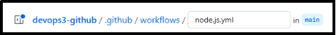

**RECURSOS**
**\

**DIVISÓRIA**	

Instalação do git

<https://www.youtube.com/watch?v=Am46OOLgV4s>

Arquivos da aula

<https://github.com/alura-cursos/allbooks/archive/refs/heads/aula-01.zip>

VScode

<https://code.visualstudio.com/>

Github

Criar uma conta de usuário

**SUBINDO ARQUIVO AO REPOSITÓRIO GIT**
**\

1 Após download dos arquivos da aula inicializar no vscode

2 Crie um novo repositório

Utilizando as configurações DEFAULT

3 Abra o terminal no VSCode

**Comandos GIT**	

**Inicializar o repositório Git em nosso projeto local.** 

git init

**Definimos um branch**

git branch -M main

**Cconectando repositório remoto com o nosso repositório local**

git remote add origin [linkrepositório]

**Listagem dos repositórios remotos configurados**

git remote

Nesse momento arquivos do diretório local serão marcados como UNTRACKED - essa informação informa que os arquivos não foram enviados ao repositório remoto

**Visualizando arquivos modificados ou adicionados no projeto ainda não incluídos no GitHub - eles serão destacados em vermelho.**

Git status

**Repassando os arquivos que serão adicionados**

**Obs. Pode-se passar um-a-um ou todos** 

git add "nomedoarquivo"

Ou

git add .

**Validando os arquivos ‘em espera’ à ser copiado ao diretório remoto**

git status

**criaremos um commit para registrar as mudanças realizadas.**

**O comando de commit registra a alteração realizada.**

git commit -m "Adiciona projeto inicial"

**Enviando arquivos**

git push origin main

**TRAZENDO ALTERAÇÕES PARA O REPOSITÓRIO LOCAL**
**\

Baixando atualizações do projeto, ao repositório local

1 Simulando alteração no projeto (como se fosse outra pessoa, que realizou a alteração);

Acesse o repositório online no github\
Acesse o arquivo README.md\
Adicione uma nova linha com a mensagem “Seja bem vindo ao projeto allbooks” \
Clique em Commit\
Depois em commit changes\
Assim criando uma alteração e commit pelo github

Acrescente a nova linha, depois commit, e commit changes

2 abra o vs code, agora iremos realizar o download das alterações presentes no repositório online, para o local;\
3 no vs code rode git log podendo visualizar a última ‘atualização realizada(commit)’ essa é uma informação está local, ou seja, ainda não é possível ver a atualização feito na via interface, a nova alteração ainda não foi baixada.\

Na interface é exibido 2 commits enquanto localmente podemos visualizar apenas 1

\

4 trazendo o novo código, e histórico de alteração no repositório online ao repositório local

git pull origin main

5 rode novamente o git log para validar as novas alterações

git log

**CRIANDO UMA NOVA BRANCH**
**\

**BRANCHES**	

As branches, permite trabalharmos no código de maneira isolada a branch main - aloca o código principal (produção) | Os novos códigos ou novas inserções(códigos, diretórios, libs e etc..) devem ser testadas numa branch separada da main, as alterações no código são enviadas ao repositório remoto(github), via commits.

A adição de uma nova branch, permite usar o código de produção em um local apartado, assim podendo realizar comits e testes sem alterar o código de produção principal na main. | Ao criar uma nova branch essa é uma nova ramificação do código, onde podemos realizar alteração e commits sem alterar a main. Ao criar uma nova branch essa  carrega consigo os commits e histórico anteriores

Assim funciona o fluxo de trabalho, ex: caso queira trabalhar com uma nova feature, ou atualização, pode-se criar uma nova branch, e trabalhar nela de maneira apartada da main

A atividade, tem como finalidade \
1 Criar uma nova branch para trabalhar de maneira isolada do código principal(produção)\
2 aplicar adição de diretórios(com novos recursos ao projeto allbooks) e também adição de novos arquivos de código 3 Realizar testes locais, e após os testes iremos subir as novas alterações ao repositório online

**COMANDOS**	

**O comando git branch exibe as branches criadas**

git branch

**Criando uma nova branch e alternando para ela**

git checkout -b teste

*O comando git checkout permite alternar entre branches*

*git checkout [branchnome]*

Se tiver 1,2,3 branches - podemos alternar entre elas com o comando,\
\
Erro comum: Adicionar arquivos antes de mudar para a branch correta pode fazer com que as alterações acabem na branch errada (como main). Isso complica o histórico do projeto.\
**- Crie a branch e mude para ela, depois adicione os arquivos, e depois suba ao repositório.**

\
**Recurso**: https://github.com/alura-cursos/allbooks/archive/refs/heads/testes.zip

No arquivo existe dois arquivos, uma pasta test e um arquivo teste.json

\- Esse arquivo contém um bloco de código que tem como finalidade realizar testes no código

\- É necessário extrair no local correto do diretório do projeto allbooks

A paste test, vai no diretório src

\
O arquivo test.json vai no diretório src/data

\
\
\
\
\

**Após a adição dos arquivos, rode o comando(aqui rodamos o novo código e validamos se está ok)** 

npm test\
\
**O comando npm test, não faz parte do git e sim do javascript(node.js)**

\
**Caso o erro acima:** O erro ocorre porque o Node.js procurou pelo comando jest, mas não encontrou ele instalado no projeto nem globalmente

**Rode o comando: npm install --save-dev jest**\
obs:** Isso adiciona o Jest na pasta node\_modules do projeto e no package.json, na seção devDependencies

**Rode novamente**\
npm test

**Após a mensagem de ok, devemos subir as alterações à branch test**

Git status

Git add .

Git status 	- validar adição do arquivo e pasta

Git commit -m “adiciona os arquivos de test”

Git push origin teste

**FAZENDO UM MERGE**
**\

Um merge é feito entre duas branches, como visto na atividade anterior. Temos a branch principal main, e criamos uma nova branch teste que contém o novo código(parte de código) com finalidade de realizar testes. Como houve sucesso com o novo código devemos agora integrar a branch teste a branch main.

**- Verificar em qual branch estamos atualmente**

git branch

Obs: espera-se estar na branch teste

**- Mudar da branch teste para a branch main**

git checkout main

Obs: alteramos para a main

Obs: podemos observar que ao mudar para a main a pasta test e teste.json não existem

Obs: a pasta teste e teste.json existem apenas na branch teste

**- Verificar se mudarmos para a branch main**

Git branch

**- Integrando o código de teste para a main**

git merge teste

Obs: agora podemos ver que a pasta teste e teste.json foram integradas a main

**- subindo as alterações ao repositório remoto**

` `git push origin main

` `**- Deletando as branch teste localmente**

git branch -D teste

**- Deletando a branch teste no repositório remoto**

git push origin teste --delete

\
Processo; Estavamos na main, para testar novos códigos criamos a branch teste, após os testes e validar que está tudo ok, realizamos um merge, integrando o código da na branch testes para a branch main.

Ao trabalhar com branches temos duas metodologias - gitflow e trunkbased

A mais utilizada é gitflow

**LIDANDO COM CONFLITOS**
**\

Em algumas situações, pode haver de entrar duas modificações no mesmo bloco de código. Quando isso ocorra, é instaurado um conflito onde deve-se escolher qual a alteração mais adequada para o contexto. Nessa atividade iremos simular essas duas alterações uma com origem via interface outra via vscode e verificar o comportamento do github nessa situação.

**- Faça uma mudança via github(repositório online)**

Abra o arquivo server.js

Mude o texto de:

Para:\

**Salve às alterações;**\
\
\- Faça uma mudança via VSCode(localmente)

Mude o texto de:

Para:

Nesse ponto, temos duas alterações no mesmo código pendentes.

**COMANDOS**	

Git status

Git add .

Git commit -m “altera o server.js”

Git push origin main

**Obs: espera-se com indicativo de que existe uma alteração no repositório online que não está presente localmente.**

**Traga às alterações que estão presentes arquivo(repositório online)**

Git pull origin main

**Obs: Aqui será exibido a mensagem de conflito**

\- Ao ir no arquivo indicado, no explorador de arquivos - o vscode irá sinalizar com esclamação, notificando o conflito.\
\- Ou é redirecionado ao conflito no vscode

Em verde, é a alteração local

E em azul, é a alteração feito via interface do gihub

**No topo, temos duas opções:**\
Aceitar alteração atual - **alteração que foi feito via vscode**

Ou 

Aceitar alteração de entrada - **alteração que foi feito via interface do github** Ao selecionar, uma das alterações serão rejeitadas.

Git commit

Git add .

Git commit

Obs: ao pressionar enter, o git hub, ira abrir o editor com mensagem de resolução de conflito. Caso algo precise ser acrescido. Só escrever. Salve o arquivo. Automaticamente voltando ao vscode. Será exibido mensagem de merge.

Git push origin main

**TRABALHANDO COM ISSUES**
**\

-No github é possível trabalhar com issues meio para definir atividades para evolução do projeto

A atividade tem como finalidade, abrir um issue, trabalhar na resolução. Uso de branch, revisão e integração da nova alteração a branch principal.

**Exemplo de uso:**

Você cria uma branch chamada nova-funcionalidade.

Faz alterações e dá commit.

Sobe para o GitHub com git push origin nova-funcionalidade.

**No GitHub, cria um pull request para pedir que suas mudanças sejam mescladas na main. No pull request você pode:**

Ver o que foi alterado.

Discutir com outros desenvolvedores.

Resolver conflitos, se existirem.

Aprovar ou rejeitar a mesclagem.

**Abertura**	

No menu superior issues, podemos criar uma nova issue - informando titulo descrição, podendo vincular uma pessoa para atividade e também um rótulo. Após acrescentar as informações, abra a issue.

**Trabalhando issue e encerrando** 	

Para seguir com a alteração, deve-se abrir uma nova branch e aplicar às alterações. Esse passo é importante pois ao final é possível realizar o comparativo de código, e revisar antes de integrar a branch principal.

**Criar uma nova branch -** Abra o vscode e aplique às mudanças\
Git chekout -b altera-rota

**Realize a alteração**

Abra o arquivo - routes>publicRoute.js

**antes**

**Depois**

\
**Após a alteração, iremos preparar às alterações e subi-las para a nova branch altera-rota**

` `git add .

**Commit às mudanças**

git commit -m “alteração de nomenclatura registrar para cadastrar”

**Envie às alterações**

git push origin altera-rota

**VOLTANDO A INTERFACE DO GITHUB**

No github irá aparecer o menu ‘compare’ onde podemos comparar às alterações que estão na branch altera-rota com a main. Através desse menu podemos realizar a comparação e revisão e realizar um merge integrando a nova branch a main.\
Obs: aqui podemos usar o menu compare ou criar uma nova pullrequest

Vinculando o pull request a uma issue em aberto; Use a palavra FIX e selecione a issue em aberto. Ao tomar essa ação a issue é formalmente encerrada e um merge entre as branches é realizado.\

No menu superior de issues, mostra que a issue foi resolvido. Foi encerrado automáticamente conforme o passo anterior. Em closed podemos visualizar o histórico da issue.

**- Após as alterações realize um git pull para baixar o novo código localmente**

Git pull origin main

` `**- Deletando as branch teste localmente**

git branch -D teste

**- Deletando a branch teste no repositório remoto**

git push origin teste --delete

**INTEGRAÇÃO CONTÍNUA - GIT ACTIONS**
**\

A integração contínua (CI) é configurada no GitHub Actions para que sempre que um novo código for integrado à branch principal do projeto Allbooks, ele seja automaticamente testado. Esse processo acontece em uma máquina virtual (VM) do próprio GitHub, que executa os testes e devolve o resultado. Assim, garantimos que o código novo não quebre funcionalidades existentes, mantendo a qualidade da aplicação.

No GitHub, acesse a aba "Actions" para configurar a automação do projeto. Vá até a seção "Continuous Integration" e escolha a opção do Node.js. Clique em "Configure", e o GitHub gerará um arquivo chamado node.js.yml. 

Nesse campo, o nome padrão do arquivo node.js.yml podemos definir o nome da action; workflow-ci.yml\
Ao setar essas configurações é criado um novo diretório com arquivo: allbooks/.github/workflows

\
**ENTENDENDO O PADRÃO DO ARQUIVO**	

\# This workflow will do a clean installation of node dependencies, cache/restore them, build the source code and run tests across different versions of node

\# For more information see: https://docs.github.com/en/actions/automating-builds-and-tests/building-and-testing-nodejs

**# Nome do workflow**

name: Node.js CI

**# Eventos que disparam o workflow**

on:

`  `push:

`    `branches: [ "main" ]  **# Quando houver push na branch main**

`  `pull\_request:

`    `branches: [ "main" ]  **# Quando uma pull request for feita para a branch main**

**# Definição do job principal**

jobs:

`  `build:

`    `**# Ambiente em que o job será executado**

`    `runs-on: ubuntu-latest  **# Usa a última versão do Ubuntu disponível no GitHub Actions**

`    `**# Estratégia para rodar em múltiplas versões do Node.js**

`    `strategy:

`      `matrix:

`        `node-version: [18.x, 20.x, 22.x]  **# Versões do Node.js a serem testadas**

`    `**# Etapas do job**

`    `steps:

`    `- uses: actions/checkout@v4  **# Faz o checkout do repositório**

`    `- name: Use Node.js ${{ matrix.node-version }}

`      `uses: actions/setup-node@v4  **# Configura o Node.js**

`      `with:

`        `node-version: ${{ matrix.node-version }}  **# Usa a versão definida na matriz**

`        `cache: 'npm'  **# Ativa o cache de dependências npm**

`    `- run: npm ci  **# Instala as dependências de forma limpa com base no package-lock.json**

`    `- run: npm run build --if-present  **# Executa o build se o script estiver presente**

`    `- run: npm test  **# Executa os testes definidos no package.json**

Necessário verificar versão do node atual

Node --version

E em node-version no padrão do arquivo, colocar os numero iniciais da versão

**ARQUIVO DEFINIDO PARA O WORKFLOW**	

name: Workflow de Integração Contínua

on:

`  `push:

`    `branches: [ "main"]

`  `pull\_request:

`    `branches: [ "main"]

jobs:

`  `continuous-integration:

`    `runs-on: ubuntu-latest

`    `steps:

`    `- uses: actions/checkout@v3

`    `- name: Use Node.js

`      `uses: actions/setup-node@v3

`      `with:

`        `node-version: 22.

`    `- run: npm install

`    `- run: npm test

**Commite às alterações**

**TESTANDO O WORKFLOW**	

Abra o vscode

Crie uma nova branch com o nome altera-server

Git checkout -b altera-server

Na raiz, localize o arquivo server.js

Na linha 22 do arquivo altere o nome de ‘API disponível através da url’ para ‘Acesse sua API em’

Salve o arquivo

Git add .

Git commit -m “alteração no server.js”

Git push origin ‘altera-server’

Após os passos acima, crie uma nova pull request, durante o pull request ao clicar nos detalhes da execução do workflow podemos verificar em ação

**PROTEGENDO A BRANCH MAIN**
**\

**Acesse as Configurações do Repositório:**

No GitHub, abra o seu projeto e vá até o menu superior. Clique em "Settings" (Configurações).

**Vá para a Seção de Branches:**

No menu lateral esquerdo, encontre a seção Branches.

**Crie uma Regra de Proteção:**

Na tela de Branches, clique em "Add classic branch protection rule".

No campo "Branch name pattern", insira o nome da branch que deseja proteger (exemplo: main).

*Isso impedirá que alterações sejam feitas diretamente na branch principal sem passar por revisão.*

\
**Configure as Regras de Proteção:**

Selecione "Require a pull request before merging" (Obrigar um pull request antes do merge).

Opcionalmente, desmarque a opção de aprovações se desejar.

**Finalize a Configuração:**

Clique em "Create" para salvar a proteção da branch.

**DEPENDABOT**
**\

CONFIGURANDO O DEPENDABOT NO GITHUB

\
O Dependabot é uma ferramenta integrada ao GitHub que monitora e atualiza automaticamente as dependências do seu projeto. Ele ajuda a manter as bibliotecas sempre atualizadas e seguras, corrigindo vulnerabilidades e evitando problemas de compatibilidade.

**Visualizando as dependências do projeto**

\- Acesse o repositório no GitHub

\- Vá em: Insights > Dependency Graph

\- Aqui você verá uma visualização de todas as dependências que seu projeto utiliza

**Ativando os alertas de segurança do Dependabot**

\- Vá para: Settings > Security > Code security and analysis

\- Ative a opção Dependabot alerts para receber notificações quando forem detectadas vulnerabilidades nas dependências

\- Ative também Dependabot security updates para permitir que o bot crie pull requests automáticos com as correções sugeridas

**Visualizando e respondendo aos alertas**

\- Vá em: Security > Dependabot

\- Todos os alertas de segurança serão listados aqui

\- Clique em um alerta específico

\- Clique em Create Dependabot security update para o GitHub gerar automaticamente uma correção com pull request

**Automatizando o processo de atualização de versões**

\- Vá para: Settings > Security > Code security and analysis

\- Ative a opção Dependabot version updates

Isso permite que o Dependabot crie automaticamente pull requests sempre que novas versões de bibliotecas forem lançadas.

Crie o arquivo .github/dependabot.yml com o seguinte conteúdo:

\# To get started with Dependabot version updates, you'll need to specify which 

\# package ecosystems to update and where the package manifests are located. 

\# Please see the documentation for all configuration options:

\# https://docs.github.com/github/administering-a-repository/configuration-options-for-dependency-updates

version: 2

updates:

\- package-ecosystem: "npm" # See documentation for possible values

directory: "/" # Location of package manifests

schedule:

`    `interval: "weekly"

\- Crie uma pasta .github na raiz do repositório (caso não exista)

\- Dentro dela, crie o arquivo dependabot.yml

\- Cole o conteúdo acima

\- Salve, faça o commit e dê merge na branch principal

Documentação oficial com outras opções de configuração:

https://docs.github.com/github/administering-a-repository/configuration-options-for-dependency-updates

7\. Gerenciando os Pull Requests criados

\- Vá em: Pull Requests

\- Revise os PRs criados automaticamente pelo Dependabot

\- Faça o merge caso a atualização esteja correta e segura

